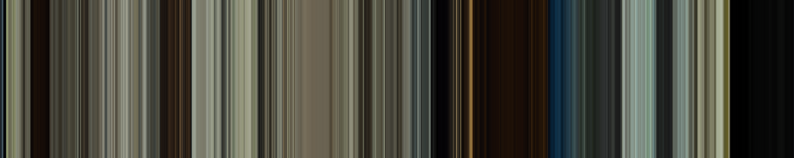
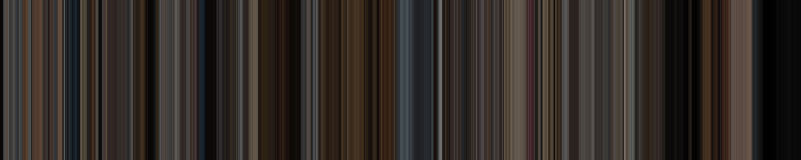
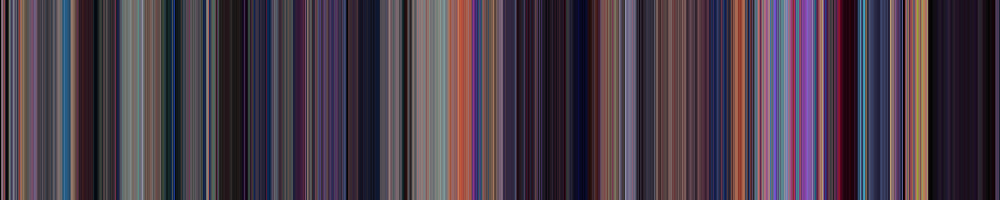
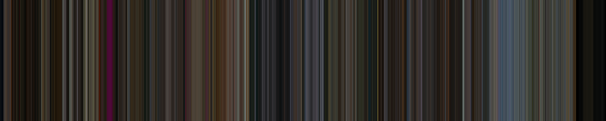
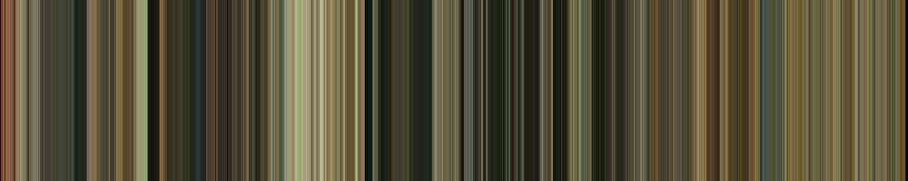

# Movie Color Band

Transform your video into a color band of 1000 pixels. The goal of this project was to mimic what can be often seen on the internet where movies are transformed into a color palette.

You can run the script with the following command :
```
python MovieColorBand.py <path-to-video>
```

## Examples

1917 - 2019 from Sam Mendes :



Prisoners - 2013 from Denis Villeneuve :



Spider-Man: Into the Spider-Verse - 2018 from Peter Ramsey, Bob Persichetti and Rodney Rothman :



The Gentlemen - 2020 from Guy Ritchie :



The Good the Bad and the Ugly - 1966 from Sergio Leone :

